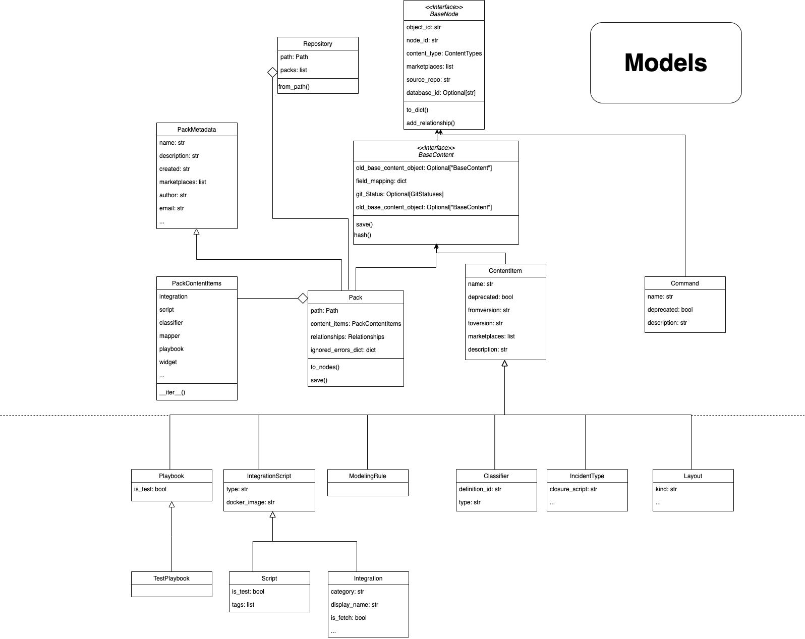

## Content Graph Commands

**A set of commands used for creating, loading and managing a graph database representation of content repository.**

### Architecture
The database is implemented with [neo4j](https://neo4j.com/) platform, and populated with data using [neo4j python driver](https://neo4j.com/docs/api/python-driver/current/api.html).
In the database, every content object has a unique **node** which contains its properties. Nodes of content objects that are associated with each other (E.g., a playbook A uses a script B) have a directed **relationship** between them.

#### Relationship Types
* IN_PACK
* USES
* HAS_COMMAND
* TESTED_BY
* IMPORTS
* DEPENDS_ON

### create-content-graph
**Creates a content graph from a given repository.**
This commands parses all content packs under the repository, including their relationships. Then, the parsed content objects are mapped to a Repository model and uploaded to the database.

 

#### Arguments

* **-o, --output-path**

    Output folder to place the zip file of the graph exported CSVs files

* **-mp, --marketplace**

    The marketplace to generate the graph for.

* **-nd, --no-dependencies**

    Whether skip dependencies should be included in the graph.

* **-v, --verbose**

    Verbosity level -v / -vv / .. / -vvv.

* **-q, --quite**

    Quiet output, only output results in the end.

* **-lp, --log-path**

    Path to store all levels of logs.

### update-content-graph
**Updates the content graph from the official content graph**
This commands downloads the official content graph, imports it locally, and updates it with the changes in the given repository or by an argument of packs to update with.

#### Arguments

* **-o, --output-path**

    Output folder to place the zip file of the graph exported CSVs files

* **-mp, --marketplace**

    The marketplace to generate the graph for.

* **-g, --use-git**

    Whether to use git to determine the packs to update.

* **-p, --packs**

    A comma-separated list of packs to update.

* **-i, --imported_path**

    Path to content graph zip file to import.

* **--use-current**

    Whether to use the current content graph to update.

* **-nd, --no-dependencies**

    Whether skip dependencies should be included in the graph.

* **-v, --verbose**

    Verbosity level -v / -vv / .. / -vvv.

* **-q, --quite**

    Quiet output, only output results in the end.

* **-lp, --log-path**

    Path to store all levels of logs.
