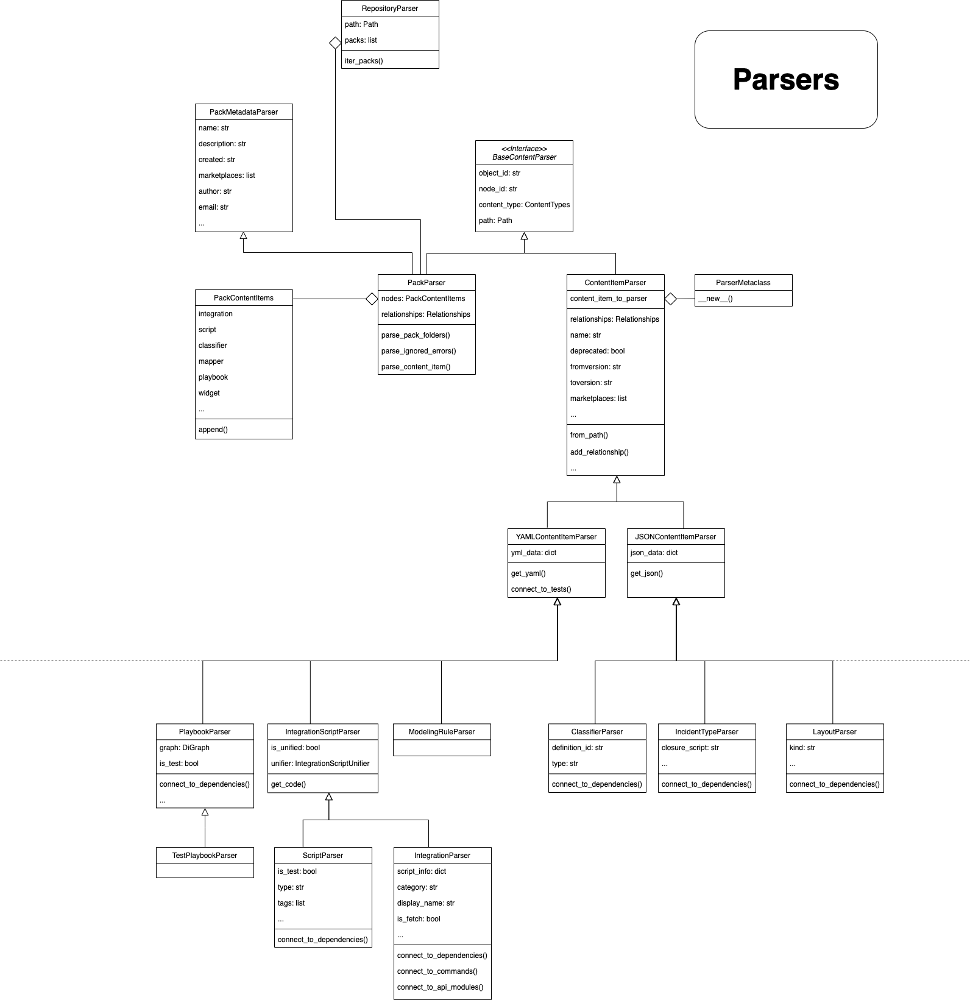

## Content Graph Commands

**A set of commands used for creating, loading and managing a graph database representation of content repository.**

### Architecture
The database is implemented with [neo4j](https://neo4j.com/) platform, and populated with data using [neo4j python driver](https://neo4j.com/docs/api/python-driver/current/api.html).
In the database, every content object has a unique **node** which contains its properties. Nodes of content objects that are associated with each other (E.g., a playbook A uses a script B) have a directed **relationship** between them.


### Usage

#### Docker (recommended)

This commands will start a `neo4j` service on Docker by default. Docker application should be running on the machine, and the service will be configured automatically.

#### Locally (advanced)

If you prefer to manually install `neo4j` on your machine, install it from [here](https://neo4j.com/docs/operations-manual/current/installation/) and configure the following files in the [configuration](https://neo4j.com/docs/operations-manual/current/configuration/file-locations/) folder, based on your OS:

* `neo4j.conf`

```
dbms.security.procedures.unrestricted=apoc.*
dbms.security.procedures.allowlist=apoc.*
```

* `apoc.conf`

```
apoc.export.file.enabled=true
apoc.import.file.enabled=true
apoc.import.file.use_neo4j_config=true
```


#### Relationship Types
* IN_PACK
* USES
* HAS_COMMAND
* TESTED_BY
* IMPORTS
* DEPENDS_ON

### create (formerly: create-content-graph)
**Creates a content graph from a given repository.**
This commands parses all content packs under the repository, including their relationships. Then, the parsed content objects are mapped to a Repository model and uploaded to the database.
When the graph creation is completed, it will be available in http://localhost:7474 (the username is `neo4j` and the password is `contentgraph`).

 

#### Arguments

* **-o, --output-path**

    Output folder to place the zip file of the graph exported CSVs files

* **-mp, --marketplace**

    The marketplace to generate the graph for.

* **-nd, --no-dependencies**

    Whether skip dependencies should be included in the graph.

* **-v, --verbose**

    Verbosity level -v / -vv / .. / -vvv.

* **-q, --quite**

    Quiet output, only output results in the end.

* **-lp, --log_file_path**

    Path to store all levels of logs.

#### Example
```
demisto-sdk graph create
```


### update (formerly: update-content-graph)
**Updates the content graph from the official content graph**
This commands downloads the official content graph, imports it locally, and updates it with the changes in the given repository or by an argument of packs to update with.
When the graph update is completed, it will be available in http://localhost:7474 (the username is `neo4j` and the password is `contentgraph`).

#### Arguments

* **-o, --output-path**

    Output folder to place the zip file of the graph exported CSVs files

* **-mp, --marketplace**

    The marketplace to generate the graph for.

* **-g, --use-git**

    Whether to use git to determine the packs to update.

* **-p, --packs**

    A comma-separated list of packs to update.

* **-i, --imported_path**

    Path to content graph zip file to import.

* **-nd, --no-dependencies**

    Whether skip dependencies should be included in the graph.

* **-v, --verbose**

    Verbosity level -v / -vv / .. / -vvv.

* **-q, --quite**

    Quiet output, only output results in the end.

* **-lp, --log_file_path**

    Path to store all levels of logs.

#### Environment Variables

DEMISTO_SDK_GRAPH_FORCE_CREATE - Whether to create the content graph instead of updating it. Will be used in all commands which use the content graph.

#### Example
```
demisto-sdk graph update -g
```

### get-relationships
Returns relationships of a given content object.

#### Arguments
* **input**

    The path to a content item or a pack. [required]

* **-ct, --content-type**

    The content type of the related object.

* **-d, --depth**

    Maximum depth (length) of the relationships paths.

* **-u/nu, --update-graph/--no-update-graph**

    If true, runs an update on the graph before querying.

* **-mp, --marketplace**

    The marketplace to generate the graph for.

* **--mandatory-only**

    If true, returns only mandatory relationships (relevant only for DEPENDS_ON/USES relationships).

* **--include-tests**

    If true, includes tests in outputs (relevant only for DEPENDS_ON/USES relationships).

* **--include-deprecated**

    If true, includes deprecated in outputs.

* **--include-hidden**

    If true, includes hidden packs in outputs (relevant only for DEPENDS_ON relationships).

* **-dir, --direction**

    Specifies whether to return only sources, only targets or both.

* **-o, --output**

    A path to a directory in which to dump the outputs to.

* **-clt, --console_log_threshold**

    Minimum logging threshold for the console logger.

* **-flt, --file_log_threshold**

    Minimum logging threshold for the file logger.

* **-lp, --log_file_path**

    Path to store all levels of logs.

#### Examples
```
demisto-sdk graph get-relationships Packs/SplunkPy/Integrations/SplunkPy/SplunkPy.yml
```
```
demisto-sdk graph get-relationships Packs/Jira -d 5 --relationship depends_on --mandatory-only --direction targets
```

### get-dependencies
Returns dependencies of a given content pack.

#### Arguments
* **pack**

    The ID of the pack to check dependencies for. [required]

* **-sr, --show-reasons**

    This flag prints all of the relationships between the given content pack and its dependencies. The default is not to print these relationships.

* **-d, --dependency**

    A specific dependency pack ID to get the data for.

* **-mp, --marketplace**

    The marketplace to generate the graph for. The default value is xsoar. Other options are marketplacev2, xpanse, xsoar_saas, xsoar_on_prem.

* **-m, --mandatory-only**

    If provided, returns only mandatory dependencies in the result.

* **-ald, --all-level-dependencies**

    If provided, will retrieve all level of dependencies.

* **--include-test-dependencies**

    If provided, includes test dependencies in result.

* **--include-hidden**

    If provided, includes hidden packs dependencies in result.

* **-dir, --direction**

    Specifies whether to return only sources, only targets or both sides of dependencies [Default is only targets].

* **-nu, --no-update-graph**

    If provided, does not run an update on the graph before querying. If you do not include this argument, the update is run.

* **-o, --output**

    A path to a directory in which to dump the outputs to.

* **-clt, --console_log_threshold**

    Minimum logging threshold for the console logger.

* **-flt, --file_log_threshold**

    Minimum logging threshold for the file logger.

* **-lp, --log_file_path**

    Path to store all levels of logs.

#### Examples
```
demisto-sdk graph get-dependencies SplunkPy -sr
```
```
demisto-sdk graph get-dependencies Campaign -sr --include-test-dependencies --include-hidden -ald -m
```
```
demisto-sdk graph get-dependencies Campaign -sr -ald -m -dir both
```
```
demisto-sdk graph get-dependencies Campaign -sr -dir both -d Phishing
```
