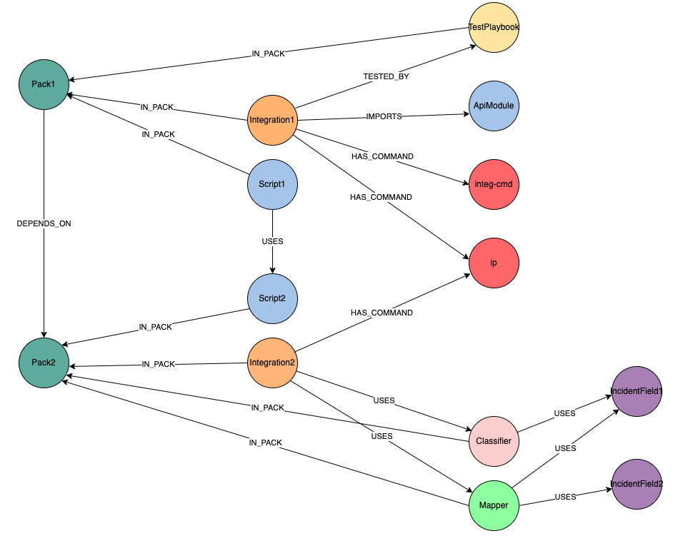

## Content Graph Commands

**A set of commands used for creating, loading and managing a graph database representation of content repository.**

### Architecture
The database is implemented with [neo4j](https://neo4j.com/) platform, and populated with data using [neo4j python driver](https://neo4j.com/docs/api/python-driver/current/api.html).
In the database, every content object has a unique **node** which contains its properties. Nodes of content objects that are associated with each other (E.g., a playbook A uses a script B) have a directed **relationship** between them.

#### Relationship Types
* IN_PACK
* USES
* HAS_COMMAND
* TESTED_BY
* IMPORTS
* DEPENDS_ON

### create-content-graph
**Creates a content graph from a given repository.**
This commands parses all content packs under the repository, including their relationships. Then, the parsed content objects are mapped to a Repository model and uploaded to the database.

 

#### Arguments
* **-ud, --use-docker**

    Use docker to create the content graph.

* **-us, --use-existing**

    Use existing service.

* **-se, --skip-export**

    Whether or not to skip exporting to CSV. Defaults to false.
    Note: using docker, the import directory to which the CSV files are downloaded, is mounted from `$REPO_PATH/neo4j-data/import`

* **-nd, --no-dependencies**

    Whether or not to include dependencies.

* **-o, --output-file**

    dump file output.

* **-v, --verbose**

    Verbosity level -v / -vv / .. / -vvv.

* **-q, --quite**

    Quiet output, only output results in the end.

* **-lp, --log-path**

    Path to store all levels of logs.

### update-content-graph
**Updates a content graph of a given repository.**
The command imports a content graph representing its previous state (e.g., last upload commit), and then updates only the packs given as arguments.

#### Arguments
In addition to all of *create-content-graph* arguments:
* **-p, --packs**

    A comma-separated list of packs to update.
