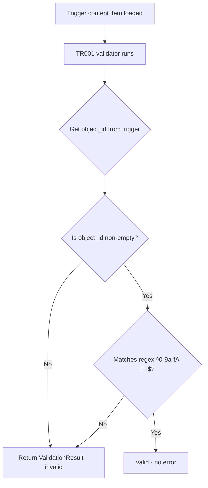

# TR001 - Validate Trigger ID Format

## Ticket Reference
**CRTX-236170** — Triggers: Validate that the `trigger_id` doesn't contain any special characters (not `-` or `.`), and should be a string UUID (hex string).

## Summary
Create a new validation `TR001` in the `TR_validators` directory that checks the `trigger_id` field of a Trigger content item is a valid hex string — containing only characters `[0-9a-fA-F]` with no dashes, dots, or other special characters.

### Valid Example
```json
{
  "trigger_id": "9ba5cc715622f50eddd58ab5c413f58b"
}
```

### Invalid Examples
```json
{ "trigger_id": "9ba5cc71-5622-f50e-ddd5-8ab5c413f58b" }  // contains dashes
{ "trigger_id": "9ba5cc71.5622.f50e.ddd5.8ab5c413f58b" }  // contains dots
{ "trigger_id": "my-trigger-name" }                         // not a hex string
{ "trigger_id": "" }                                        // empty string
```

---

## Architecture & Key Findings

### How Trigger ID is Accessed
- The `trigger_id` JSON field is mapped to `object_id` via `field_mapping` in `TriggerParser`
- In the `Trigger` model, `object_id` is inherited from `BaseContent` as `object_id: str = Field(alias="id")`
- The raw `trigger_id` can also be accessed via `content_item.data.get("trigger_id")` or simply `content_item.object_id`

### Existing Patterns to Follow
- **Validator file**: `TR_validators/TR100_is_silent_trigger.py` — simple validator with no fix
- **Test file**: `tests/TR_validators_test.py` — uses `create_trigger_object()` helper with parametrized tests
- **Test helper**: `create_trigger_object(paths, values, file_name)` in `tests/test_tools.py` — loads `trigger.json` test data
- **Config registration**: `sdk_validation_config.toml` — TR100 appears in `path_based_validations.select` and `use_git.select`

---

## Implementation Plan

### Step 1: Create Validator File
**File**: `demisto_sdk/commands/validate/validators/TR_validators/TR001_is_valid_trigger_id.py`

```python
from __future__ import annotations

import re
from typing import Iterable, List, Union

from demisto_sdk.commands.content_graph.objects.trigger import Trigger
from demisto_sdk.commands.validate.validators.base_validator import (
    BaseValidator,
    ValidationResult,
)

ContentTypes = Union[Trigger]

# Regex: only hex characters (0-9, a-f, A-F), non-empty
VALID_TRIGGER_ID_PATTERN = re.compile(r"^[0-9a-fA-F]+$")


class IsValidTriggerIdValidator(BaseValidator[ContentTypes]):
    error_code = "TR001"
    description = "Validate that the trigger_id is a valid hex string UUID without special characters."
    rationale = (
        "The trigger_id must be a hex string containing only characters [0-9a-fA-F]. "
        "It must not contain dashes, dots, or any other special characters."
    )
    error_message = (
        "The trigger_id '{0}' is invalid. "
        "It must be a hex string containing only characters [0-9a-fA-F] with no special characters like '-' or '.'."
    )
    related_field = "trigger_id"
    is_auto_fixable = False

    def obtain_invalid_content_items(
        self, content_items: Iterable[ContentTypes]
    ) -> List[ValidationResult]:
        return [
            ValidationResult(
                validator=self,
                message=self.error_message.format(content_item.object_id),
                content_object=content_item,
            )
            for content_item in content_items
            if not is_valid_trigger_id(content_item.object_id)
        ]


def is_valid_trigger_id(trigger_id: str) -> bool:
    if not trigger_id:
        return False
    return bool(VALID_TRIGGER_ID_PATTERN.match(trigger_id))
```

### Step 2: Add Tests
**File**: `demisto_sdk/commands/validate/tests/TR_validators_test.py` (append to existing)

Add parametrized test cases:
- **Valid**: `"9ba5cc715622f50eddd58ab5c413f58b"` — standard hex string → passes
- **Valid**: `"73545719a1bdeba6ba91f6a16044c021"` — another hex string → passes
- **Valid**: `"ABCDEF0123456789abcdef0123456789"` — mixed case hex → passes
- **Invalid**: `"9ba5cc71-5622-f50e-ddd5-8ab5c413f58b"` — contains dashes → fails
- **Invalid**: `"9ba5cc71.5622.f50e"` — contains dots → fails
- **Invalid**: `"my-trigger-name"` — non-hex with dashes → fails
- **Invalid**: `""` — empty string → fails
- **Invalid**: `"xyz123"` — contains non-hex chars → fails

### Step 3: Register in Config
**File**: `demisto_sdk/commands/validate/sdk_validation_config.toml`

Add `"TR001"` to:
1. `[path_based_validations] select` — next to `"TR100"` at line 262
2. `[use_git] select` — next to `"TR100"` at line 568

---

## Files to Modify

| File | Action |
|------|--------|
| `demisto_sdk/commands/validate/validators/TR_validators/TR001_is_valid_trigger_id.py` | **CREATE** — New validator |
| `demisto_sdk/commands/validate/tests/TR_validators_test.py` | **MODIFY** — Add test cases |
| `demisto_sdk/commands/validate/sdk_validation_config.toml` | **MODIFY** — Register TR001 |

## Flow Diagram


