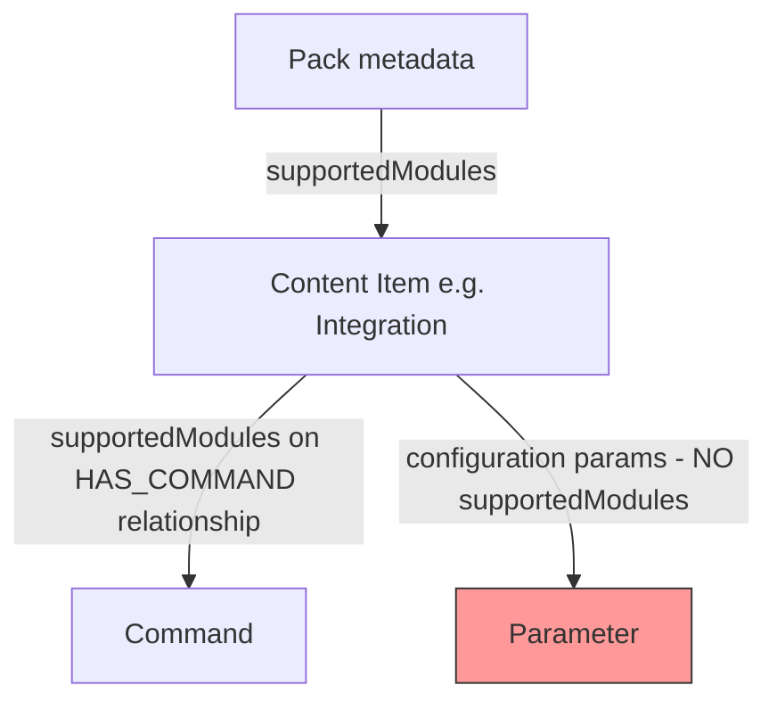
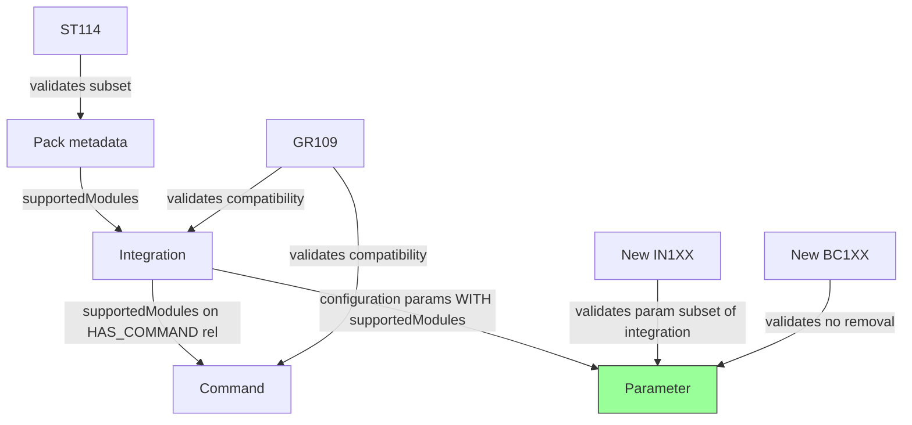

# Plan: Add `supportedModules` Support for Integration Parameters

## Overview

This plan extends the existing `supportedModules` support (currently at integration-level and command-level) to also work at the **integration parameter level** — i.e., individual configuration parameters of an integration can specify which modules they support.

## Current Architecture



### Existing `supportedModules` Flow

1. **Pack level**: `pack_metadata.json` → `supportedModules` field → parsed in [`PackParser`](demisto_sdk/commands/content_graph/parsers/pack.py:202)
2. **Content item level**: Inherited from pack or overridden in YAML → parsed in [`YAMLContentItemParser`](demisto_sdk/commands/content_graph/parsers/yaml_content_item.py:43)
3. **Command level**: Defined per command in integration YAML → parsed in [`IntegrationParser.connect_to_commands()`](demisto_sdk/commands/content_graph/parsers/integration.py:114) → stored on `HAS_COMMAND` relationship in Neo4j

### Key Components

| Component | File | Role |
|-----------|------|------|
| `PlatformSupportedModules` enum | [`constants.py`](demisto_sdk/commands/common/constants.py:2031) | Defines valid module values |
| `Parameter` model | [`objects/integration.py`](demisto_sdk/commands/content_graph/objects/integration.py:42) | Pydantic model for integration params |
| `_Configuration` strict model | [`strict_objects/integration.py`](demisto_sdk/commands/content_graph/strict_objects/integration.py:54) | Strict validation model for params |
| `CommandParser` dataclass | [`parsers/integration.py`](demisto_sdk/commands/content_graph/parsers/integration.py:23) | Parsed command data |
| `IntegrationParser` | [`parsers/integration.py`](demisto_sdk/commands/content_graph/parsers/integration.py:35) | Parses integration YAML |
| `Command` object model | [`objects/integration.py`](demisto_sdk/commands/content_graph/objects/integration.py:64) | Runtime command model |
| GR109 validator | [`GR109_is_supported_modules_compatibility.py`](demisto_sdk/commands/validate/validators/GR_validators/GR109_is_supported_modules_compatibility.py:87) | Validates module compatibility |
| BC115 validator | [`BC115_is_supported_module_removed.py`](demisto_sdk/commands/validate/validators/BC_validators/BC115_is_supported_module_removed.py:84) | Detects removed modules |
| BC117 validator | [`BC117_is_supported_module_added.py`](demisto_sdk/commands/validate/validators/BC_validators/BC117_is_supported_module_added.py) | Detects added modules |
| ST113 validator | [`ST113_supported_modules_is_not_empty.py`](demisto_sdk/commands/validate/validators/ST_validators/ST113_supported_modules_is_not_empty.py:82) | Validates non-empty modules |
| ST114 validator | [`ST114_is_supported_modules_subset_of_pack.py`](demisto_sdk/commands/validate/validators/ST_validators/ST114_is_supported_modules_subset_of_pack.py:80) | Validates subset of pack |
| Neo4j HAS_COMMAND query | [`queries/relationships.py`](demisto_sdk/commands/content_graph/interface/neo4j/queries/relationships.py:41) | Stores `supportedModules` on relationship |
| Neo4j validation queries | [`queries/validations.py`](demisto_sdk/commands/content_graph/interface/neo4j/queries/validations.py:458) | Module mismatch queries |

---

## Changes Required

### 1. Model Changes — `Parameter` Model

**File**: [`demisto_sdk/commands/content_graph/objects/integration.py`](demisto_sdk/commands/content_graph/objects/integration.py:42)

**What to change**: Add `supportedModules` field to the `Parameter` Pydantic model.

**Current**:
```python
class Parameter(BaseModel):
    name: str
    type: int = 0
    additionalinfo: Optional[str] = None
    defaultvalue: Optional[Any] = None
    required: Optional[bool] = None
    display: Optional[str] = None
    section: Optional[str] = None
    advanced: Optional[bool] = None
    hidden: Optional[Any] = None
    options: Optional[List[str]] = None
    displaypassword: Optional[str] = None
    hiddenusername: Optional[bool] = None
    hiddenpassword: Optional[bool] = None
    fromlicense: Optional[str] = None
```

**Change to**:
```python
class Parameter(BaseModel):
    name: str
    type: int = 0
    additionalinfo: Optional[str] = None
    defaultvalue: Optional[Any] = None
    required: Optional[bool] = None
    display: Optional[str] = None
    section: Optional[str] = None
    advanced: Optional[bool] = None
    hidden: Optional[Any] = None
    options: Optional[List[str]] = None
    displaypassword: Optional[str] = None
    hiddenusername: Optional[bool] = None
    hiddenpassword: Optional[bool] = None
    fromlicense: Optional[str] = None
    supportedModules: Optional[List[str]] = None
```

**Why**: The `Parameter` model needs to carry the `supportedModules` data so it can be serialized/deserialized and used in validations.

---

### 2. Strict Schema Changes — `_Configuration` Model

**File**: [`demisto_sdk/commands/content_graph/strict_objects/integration.py`](demisto_sdk/commands/content_graph/strict_objects/integration.py:54)

**What to change**: Add `supportedModules` field to the `_Configuration` strict model with proper validation using `PlatformSupportedModules`.

**Current**:
```python
class _Configuration(BaseStrictModel):
    display: Optional[str] = None
    section: Optional[str] = None
    advanced: Optional[str] = None
    default_value: Optional[Any] = Field(None, alias="defaultvalue")
    name: str
    type: int
    required: Optional[bool] = None
    hidden: Optional[Any] = None
    options: Optional[List[str]] = None
    additional_info: Optional[str] = Field(None, alias="additionalinfo")
    display_password: Optional[str] = Field(None, alias="displaypassword")
    hidden_username: Optional[bool] = Field(None, alias="hiddenusername")
    hidden_password: Optional[bool] = Field(None, alias="hiddenpassword")
    from_license: Optional[str] = Field(None, alias="fromlicense")
```

**Change to** — add at the end:
```python
    supportedModules: Optional[
        Annotated[
            List[PlatformSupportedModules],
            Field(min_length=1, max_length=len(PlatformSupportedModules)),
        ]
    ] = None
```

**Why**: This enables strict schema validation of the `supportedModules` field on parameters, ensuring only valid module values from `PlatformSupportedModules` are used, consistent with how it is done for commands in [`_Command`](demisto_sdk/commands/content_graph/strict_objects/integration.py:100).

---

### 3. Parser Changes — Integration Parser

**File**: [`demisto_sdk/commands/content_graph/parsers/integration.py`](demisto_sdk/commands/content_graph/parsers/integration.py:96)

**What to change**: No changes needed to the parser itself for basic support. The `params` property at line 97 already returns the raw configuration list from the YAML, and the `Parameter` model will automatically pick up `supportedModules` from the YAML data when the model is constructed.

**Rationale**: The integration parser reads `configuration` from the YAML via `field_mapping` at line 87 (`"params": "configuration"`), and the `Integration` model at [`objects/integration.py:130`](demisto_sdk/commands/content_graph/objects/integration.py:130) stores `params: List[Parameter]`. Since Pydantic will automatically deserialize the `supportedModules` field from the raw dict, no parser changes are needed.

---

### 4. Integration `save()` Method

**File**: [`demisto_sdk/commands/content_graph/objects/integration.py`](demisto_sdk/commands/content_graph/objects/integration.py:229)

**What to change**: Review the `save()` method to ensure `supportedModules` is properly serialized when saving parameters.

**Current**:
```python
def save(self):
    super().save(fields_to_exclude=["params"])
    data = self.data
    data["script"]["commands"] = [command.to_raw_dict for command in self.commands]
    data["configuration"] = [param.dict(exclude_none=True) for param in self.params]
    write_dict(self.path, data, indent=4)
```

**Analysis**: The `param.dict(exclude_none=True)` call will automatically include `supportedModules` when it is not `None`. Since we set the default to `None` in the `Parameter` model, empty/unset values will be excluded. **No change needed** — the existing serialization logic handles this correctly.

---

### 5. Pack Metadata Cleanup

**File**: [`demisto_sdk/commands/content_graph/objects/pack.py`](demisto_sdk/commands/content_graph/objects/pack.py:254)

**What to change**: Add a method similar to [`_clean_empty_supportedModuels_from_commands()`](demisto_sdk/commands/content_graph/objects/pack.py:254) to also clean empty `supportedModules` from parameters in the metadata output.

**Add new method**:
```python
def _clean_empty_supported_modules_from_params(self, content_items: dict):
    if not content_items:
        return
    for integration in content_items.get("integration", []):
        if "configuration" in integration:
            for param in integration["configuration"]:
                if (
                    "supportedModules" in param
                    and not param["supportedModules"]
                ):
                    del param["supportedModules"]
```

**Also update** the [`dump_metadata()`](demisto_sdk/commands/content_graph/objects/pack.py:266) method to call this new cleanup method alongside the existing command cleanup.

**Why**: Consistent with how empty `supportedModules` is cleaned from commands to avoid serializing empty lists.

---

### 6. Validation — Parameter `supportedModules` Must Be Subset of Integration's `supportedModules`

**File**: New validator or extend existing [`ST114_is_supported_modules_subset_of_pack.py`](demisto_sdk/commands/validate/validators/ST_validators/ST114_is_supported_modules_subset_of_pack.py)

**Option A — New Validator (Recommended)**: Create a new validator `IN1XX_is_param_supported_modules_subset_of_integration.py` in `demisto_sdk/commands/validate/validators/IN_validators/`.

**What it validates**: Each parameter's `supportedModules` must be a subset of the integration's effective `supportedModules` (or the pack's if the integration doesn't define its own).

**Pseudocode**:
```python
class IsParamSupportedModulesSubsetOfIntegration(BaseValidator[Integration]):
    error_code = "IN1XX"  # Assign next available IN error code
    description = "Ensure parameter supportedModules is a subset of the integration's supportedModules."

    def obtain_invalid_content_items(self, content_items):
        results = []
        for integration in content_items:
            integration_modules = set(
                integration.supportedModules
                or integration.pack.supportedModules
                or [sm.value for sm in PlatformSupportedModules]
            )
            for param in integration.params:
                if param.supportedModules:
                    param_modules = set(param.supportedModules)
                    diff = param_modules - integration_modules
                    if diff:
                        results.append(ValidationResult(...))
        return results
```

**Why**: A parameter cannot support modules that its parent integration does not support.

---

### 7. Validation — Parameter `supportedModules` Must Not Be Empty List

**File**: Extend [`ST113_supported_modules_is_not_empty.py`](demisto_sdk/commands/validate/validators/ST_validators/ST113_supported_modules_is_not_empty.py:82) OR create a new IN validator.

**What to change**: Add validation that if a parameter has `supportedModules`, it must not be an empty list. This mirrors the existing ST113 validation for content items.

**Recommended approach**: Create a new IN validator `IN1XX_is_param_supported_modules_not_empty.py` that checks integration parameters specifically.

---

### 8. Validation — Backward Compatibility for Parameter `supportedModules`

**File**: Consider extending [`BC115_is_supported_module_removed.py`](demisto_sdk/commands/validate/validators/BC_validators/BC115_is_supported_module_removed.py:84) or creating a new BC validator.

**What to validate**: When modifying an existing integration, parameter-level `supportedModules` should not have modules removed (similar to how BC115 works for integration-level modules).

**Recommended approach**: Create a new BC validator `BC1XX_is_param_supported_module_removed.py` that compares old vs new parameter `supportedModules`.

---

### 9. Error Code Registration

**File**: [`demisto_sdk/commands/common/errors.py`](demisto_sdk/commands/common/errors.py)

**What to change**: Register new error codes for the new validators created in steps 6-8.

**Add entries** like:
```python
"param_supported_modules_not_subset_of_integration": {
    "code": "IN1XX",
    "related_field": "configuration.supportedModules",
},
"param_supported_modules_empty": {
    "code": "IN1XX",
    "related_field": "configuration.supportedModules",
},
"removed_param_supported_modules": {
    "code": "BC1XX",
    "related_field": "configuration.supportedModules",
},
```

**Why**: All validators need registered error codes.

---

### 10. Validator README Update

**File**: [`demisto_sdk/commands/validate/validators/README.md`](demisto_sdk/commands/validate/validators/README.md)

**What to change**: Add documentation entries for the new validators.

---

### 11. Test Changes

#### 11a. Parameter Model Tests

**File**: [`demisto_sdk/commands/content_graph/tests/parsers_and_models_test.py`](demisto_sdk/commands/content_graph/tests/parsers_and_models_test.py:3231)

**What to change**: Add tests for the `Parameter` model with `supportedModules`:
- Test that `Parameter(name="test", supportedModules=["cloud"])` correctly stores the field
- Test that `Parameter(name="test")` has `supportedModules` as `None`
- Test serialization with `dict(exclude_none=True)` excludes `None` supportedModules

#### 11b. Strict Schema Tests

**File**: [`demisto_sdk/commands/content_graph/tests/parsers_and_models_test.py`](demisto_sdk/commands/content_graph/tests/parsers_and_models_test.py)

**What to change**: Add tests that validate the strict `_Configuration` model accepts valid `supportedModules` and rejects invalid ones.

#### 11c. Integration Parser Tests

**File**: [`demisto_sdk/commands/content_graph/tests/parsers_and_models_test.py`](demisto_sdk/commands/content_graph/tests/parsers_and_models_test.py)

**What to change**: Add a test that creates an integration YAML with `supportedModules` on a configuration parameter, parses it, and verifies the parameter model has the correct `supportedModules`.

#### 11d. New Validator Tests

**File**: `demisto_sdk/commands/validate/tests/IN_validators_test.py`

**What to change**: Add tests for the new IN validator(s):
- Parameter with `supportedModules` that is a valid subset → passes
- Parameter with `supportedModules` containing modules not in integration → fails
- Parameter with empty `supportedModules` list → fails
- Parameter without `supportedModules` → passes

**File**: `demisto_sdk/commands/validate/tests/BC_validators_test.py`

**What to change**: Add tests for the new BC validator:
- Parameter with removed `supportedModules` modules → fails
- Parameter with unchanged `supportedModules` → passes

#### 11e. Pack Metadata Tests

**File**: [`demisto_sdk/commands/content_graph/tests/parsers_and_models_test.py`](demisto_sdk/commands/content_graph/tests/parsers_and_models_test.py) or pack metadata test files

**What to change**: Test that empty `supportedModules` on parameters is cleaned up during metadata dump.

---

### 12. Graph/Neo4j Changes — NOT Required

**Analysis**: Parameter-level `supportedModules` does **not** require Neo4j graph changes because:

1. Parameters are **not stored as separate nodes** in the graph — they are stored as a property of the Integration node (via `params: List[Parameter] = Field([], exclude=True)` at [`objects/integration.py:130`](demisto_sdk/commands/content_graph/objects/integration.py:130), note `exclude=True`).
2. Parameters don't have their own relationships in the graph.
3. The validation for parameter `supportedModules` can be done at the model level without graph queries.

The existing Neo4j queries for module mismatch (in [`queries/validations.py`](demisto_sdk/commands/content_graph/interface/neo4j/queries/validations.py:458)) operate on content item nodes and command relationships, which are unaffected by this change.

---

## Summary of Files to Modify

| # | File | Change Type | Description |
|---|------|-------------|-------------|
| 1 | [`demisto_sdk/commands/content_graph/objects/integration.py`](demisto_sdk/commands/content_graph/objects/integration.py:42) | Modify | Add `supportedModules` to `Parameter` model |
| 2 | [`demisto_sdk/commands/content_graph/strict_objects/integration.py`](demisto_sdk/commands/content_graph/strict_objects/integration.py:54) | Modify | Add `supportedModules` to `_Configuration` strict model |
| 3 | [`demisto_sdk/commands/content_graph/objects/pack.py`](demisto_sdk/commands/content_graph/objects/pack.py:254) | Modify | Add cleanup for empty param `supportedModules` |
| 4 | `demisto_sdk/commands/validate/validators/IN_validators/IN1XX_is_param_supported_modules_subset_of_integration.py` | Create | New validator: param modules ⊆ integration modules |
| 5 | `demisto_sdk/commands/validate/validators/IN_validators/IN1XX_is_param_supported_modules_not_empty.py` | Create | New validator: param modules not empty list |
| 6 | `demisto_sdk/commands/validate/validators/BC_validators/BC1XX_is_param_supported_module_removed.py` | Create | New BC validator: detect removed param modules |
| 7 | [`demisto_sdk/commands/common/errors.py`](demisto_sdk/commands/common/errors.py) | Modify | Register new error codes |
| 8 | [`demisto_sdk/commands/validate/validators/README.md`](demisto_sdk/commands/validate/validators/README.md) | Modify | Document new validators |
| 9 | [`demisto_sdk/commands/content_graph/tests/parsers_and_models_test.py`](demisto_sdk/commands/content_graph/tests/parsers_and_models_test.py) | Modify | Add Parameter model + parser tests |
| 10 | [`demisto_sdk/commands/validate/tests/IN_validators_test.py`](demisto_sdk/commands/validate/tests/IN_validators_test.py) | Modify | Add IN validator tests |
| 11 | [`demisto_sdk/commands/validate/tests/BC_validators_test.py`](demisto_sdk/commands/validate/tests/BC_validators_test.py) | Modify | Add BC validator tests |

## Files NOT Requiring Changes

| File | Reason |
|------|--------|
| [`parsers/integration.py`](demisto_sdk/commands/content_graph/parsers/integration.py) | Params are already read from YAML; Pydantic handles deserialization |
| [`queries/relationships.py`](demisto_sdk/commands/content_graph/interface/neo4j/queries/relationships.py) | Parameters are not graph relationships |
| [`queries/validations.py`](demisto_sdk/commands/content_graph/interface/neo4j/queries/validations.py) | No graph-level validation needed for params |
| [`interface/graph.py`](demisto_sdk/commands/content_graph/interface/graph.py) | No new abstract methods needed |
| [`interface/neo4j/neo4j_graph.py`](demisto_sdk/commands/content_graph/interface/neo4j/neo4j_graph.py) | No new graph methods needed |
| [`GR109_is_supported_modules_compatibility.py`](demisto_sdk/commands/validate/validators/GR_validators/GR109_is_supported_modules_compatibility.py) | GR109 validates cross-item dependencies, not intra-item params |
| [`constants.py`](demisto_sdk/commands/common/constants.py) | `PlatformSupportedModules` enum already exists |

## Implementation Order

1. **Model changes first** (steps 1-2) — foundation for everything else
2. **Pack cleanup** (step 3) — ensures clean serialization
3. **Validators** (steps 6-9) — business logic validation
4. **Tests** (step 11) — verify all changes
5. **Documentation** (step 10) — update README

## Architecture After Changes


