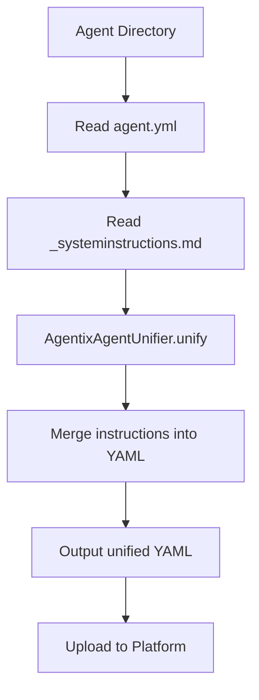
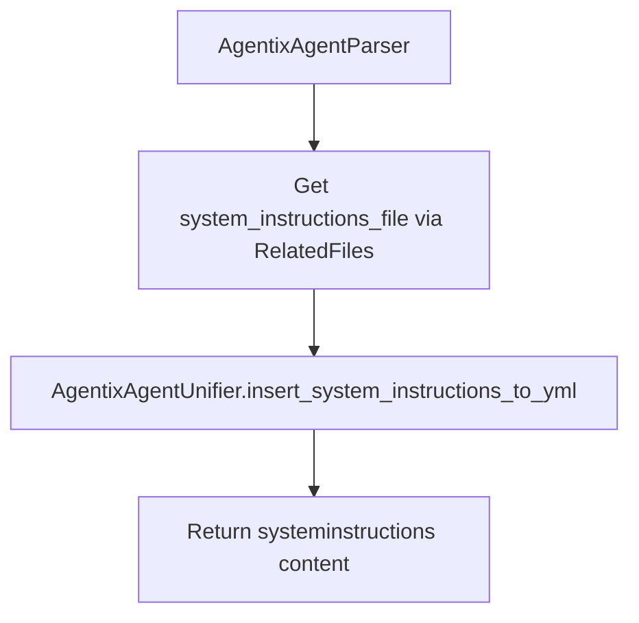

# AgentixAgent Restructuring Implementation Plan

## Overview

Restructure AgentixAgent content items to use a directory-based structure (similar to Integrations/Scripts) with system instructions in a separate file that gets merged during the content creation process.

## Requirements Summary

### Current Structure

```
Packs/MyPack/AgentixAgents/my-agent.yml
```

### New Structure

```
Packs/MyPack/AgentixAgents/MyAgent/
├── MyAgent.yml (without systeminstructions field inline)
└── MyAgent_systeminstructions.md
```

### Key Constraints

1. **Output must remain unchanged**: The final unified YAML must contain the `systeminstructions` field exactly as before
2. **No backward compatibility required**: The content repo will be updated to the new structure at release time
3. **Markdown format only**: System instructions use `.md` format (no `.txt` support)
4. **Consistent naming**: File naming follows the pattern `<folder_name>_systeminstructions.md` (similar to `<folder_name>_description.md` for integrations)
5. **Platform marketplace only**: AgentixAgents are only for the Platform marketplace, so no `replace_marketplace_references` is needed
6. **Extensible**: Design should allow adding more files in the future (README, images, etc.)

## Detailed Implementation Plan

### 1. Design Decisions

#### 1.1 File Naming Convention

**Decision**: Use `<folder_name>_systeminstructions.md` (markdown format)

- **Rationale**:
  - Consistent with existing patterns (e.g., `<folder_name>_description.md` for integrations)
  - Industry standard for AI agent instructions (OpenAI, Anthropic use markdown)
  - Allows rich formatting (code blocks, lists, emphasis)
  - Better developer experience with syntax highlighting
- **Format**: Markdown only (`.md`), no `.txt` support

**Implementation**:

- Constant `SYSTEM_INSTRUCTIONS_SUFFIX = "_systeminstructions.md"` in [`agentix_agent_unifier.py`](demisto_sdk/commands/prepare_content/agentix_agent_unifier.py)
- Related file type `RelatedFileType.SYSTEM_INSTRUCTIONS` in [`related_files.py`](demisto_sdk/commands/content_graph/parsers/related_files.py)

#### 1.2 Directory Structure Pattern

```
AgentixAgents/
├── AgentName1/              # Directory per agent
│   ├── AgentName1.yml       # Main YAML (matches folder name)
│   └── AgentName1_systeminstructions.md
├── AgentName2/
│   ├── AgentName2.yml
│   └── AgentName2_systeminstructions.md
```

**Naming Rules**:

- Directory name: PascalCase (e.g., `MyAgent`, `SecurityAnalyst`)
- YAML filename: Matches folder name (e.g., `MyAgent.yml`)
- System instructions: `<folder_name>_systeminstructions.md` (e.g., `MyAgent_systeminstructions.md`)

### 2. Core Components to Implement

#### 2.1 AgentixAgent Unifier (NEW)

**File**: [`demisto_sdk/commands/prepare_content/agentix_agent_unifier.py`](demisto_sdk/commands/prepare_content/agentix_agent_unifier.py)

**Purpose**: Merge system instructions file into YAML during content creation

**Key Methods**:

```python
class AgentixAgentUnifier(Unifier):
    """Unifier for AgentixAgent content items.
    
    Merges system instructions from a separate markdown file into the YAML
    during content creation/upload.
    """
    
    SYSTEM_INSTRUCTIONS_SUFFIX = "_systeminstructions.md"
    
    @staticmethod
    def unify(
        path: Path,
        data: dict,
        marketplace: MarketplaceVersions = None,
        **kwargs,
    ) -> dict:
        """Merges system instructions from separate file into YAML."""
        
    @staticmethod
    def get_system_instructions_file(package_path: Path) -> Optional[Path]:
        """Find <folder_name>_systeminstructions.md in package directory."""
        
    @staticmethod
    def insert_system_instructions_to_yml(
        package_path: Path, yml_unified: dict
    ) -> dict:
        """Read system instructions file and add to YAML."""
```

**Note**: Unlike `IntegrationScriptUnifier`, `AgentixAgentUnifier` does NOT call `replace_marketplace_references` because AgentixAgents are only for the Platform marketplace.

**Similar to**: [`IntegrationScriptUnifier`](demisto_sdk/commands/prepare_content/integration_script_unifier.py:69-138)

#### 2.2 Update AgentixAgent Parser

**File**: [`demisto_sdk/commands/content_graph/parsers/agentix_agent.py`](demisto_sdk/commands/content_graph/parsers/agentix_agent.py)

**Changes**:

1. Add `system_instructions_file` cached property using `SystemInstructionsRelatedFile`
2. Add `systeminstructions` property that reads from the file via the unifier
3. Use the Related Files pattern (consistent with how integrations handle description files)

**Key Logic**:

```python
@cached_property
def system_instructions_file(self) -> Optional[SystemInstructionsRelatedFile]:
    """Get the system instructions related file."""
    return self.get_related_text_file(RelatedFileType.SYSTEM_INSTRUCTIONS)

@property
def systeminstructions(self) -> str:
    """Get system instructions content from the separate file."""
    return AgentixAgentUnifier.insert_system_instructions_to_yml(
        self.path.parent, {}
    ).get("systeminstructions", "")
```

#### 2.3 Related Files Pattern

**File**: [`demisto_sdk/commands/content_graph/parsers/related_files.py`](demisto_sdk/commands/content_graph/parsers/related_files.py)

**New Components**:

1. Add `RelatedFileType.SYSTEM_INSTRUCTIONS` enum value
2. Add `SystemInstructionsRelatedFile` class extending `TextFiles`

```python
class RelatedFileType(str, Enum):
    # ... existing types ...
    SYSTEM_INSTRUCTIONS = "system_instructions"

class SystemInstructionsRelatedFile(TextFiles):
    """Related file for AgentixAgent system instructions."""
    
    @property
    def file_suffix(self) -> str:
        return "_systeminstructions.md"
```

**Note**: No new `FileType` constant is needed in `constants.py` - the system instructions file is handled as a related file, not a separate content type.

#### 2.4 TestSuite Helper Class

**Status**: ON HOLD - There is an active PR for the agent test suite. This will be addressed after that PR is merged.

**File**: [`TestSuite/agentix_agent.py`](TestSuite/agentix_agent.py)

**Purpose**: Provide test utilities for creating AgentixAgent test fixtures

**Structure** (similar to [`Integration`](TestSuite/integration.py:18-185)):

```python
class AgentixAgent(TestSuiteBase):
    def __init__(self, tmpdir: Path, name: str, repo):
        self.name = name
        self._repo = repo
        self.path = tmpdir / name  # Directory path
        self.path.mkdir()
        
        self.yml = YAML(self.path / f"{name}.yml", repo.path)
        self.system_instructions = File(
            self.path / f"{name}_systeminstructions.md",
            repo.path
        )
        
    def build(self, yml: Optional[dict] = None,
              system_instructions: Optional[str] = None):
        """Write files to disk"""
        
    def create_default_agentix_agent(self, name: str = "SampleAgent"):
        """Create agent with default template"""
```

#### 2.5 Update Default Templates

**Status**: ON HOLD - Part of the TestSuite work that will be addressed after the active PR is merged.

**Files**:

- Create: [`TestSuite/assets/default_agentix_agent/`](TestSuite/assets/default_agentix_agent/) directory
  - `agentix_agent-sample.yml` (without systeminstructions field)
  - `agentix_agent-sample_systeminstructions.md` (sample instructions)

**Template Structure**:

```yaml
# agentix_agent-sample.yml
commonfields:
  id: sample_agent
  version: -1
name: Sample Agent
description: A sample AI agent
color: "#00CD33"
visibility: internal
actionids: []
conversationstarters: []
builtinactions: []
autoenablenewactions: false
roles: []
sharedwithroles: []
```

```markdown
# agentix_agent-sample_systeminstructions.md
You are a helpful AI assistant designed to help users with their tasks.

## Your Capabilities
- Analyze and respond to user queries
- Execute actions when needed
- Provide clear and concise information

## Guidelines
- Always be helpful and professional
- Ask clarifying questions when needed
- Explain your reasoning when appropriate
```

### 3. Integration Points

#### 3.1 Format Command

**File**: [`demisto_sdk/commands/format/format_module.py`](demisto_sdk/commands/format/format_module.py)

**Changes**:

1. Add AgentixAgent to format handlers
2. Create formatter class similar to [`update_generic_agentix.py`](demisto_sdk/commands/format/update_generic_agentix.py)
3. Handle both old and new structures

#### 3.2 Validation

**Files to update**:

- Existing AG validators in [`demisto_sdk/commands/validate/validators/AG_validators/`](demisto_sdk/commands/validate/validators/AG_validators/)
- Add new validator: [`AG104_is_system_instructions_file_exists.py`](demisto_sdk/commands/validate/validators/AG_validators/AG104_is_system_instructions_file_exists.py)

**New Validation Rules**:

1. System instructions file (`<folder_name>_systeminstructions.md`) must exist
2. System instructions file must not be empty

**Validator Implementation**:

```python
class IsSystemInstructionsFileExistsValidator(BaseValidator[ContentTypes]):
    error_code = "AG104"
    description = "Validates that the system instructions file exists for AgentixAgent."
    rationale = "AgentixAgents require a system instructions file."
    error_message = "The system instructions file '{0}' does not exist."
    related_field = "systeminstructions"
    is_auto_fixable = False
    expected_git_statuses = [
        GitStatuses.ADDED,
        GitStatuses.MODIFIED,
        GitStatuses.RENAMED,
    ]
```

#### 3.3 Content Graph

**Files**:

- [`demisto_sdk/commands/content_graph/objects/agentix_agent.py`](demisto_sdk/commands/content_graph/objects/agentix_agent.py)
- [`demisto_sdk/commands/content_graph/strict_objects/agentix_agent.py`](demisto_sdk/commands/content_graph/strict_objects/agentix_agent.py)

**Changes**:

1. Add `system_instructions_file` property to `AgentixAgent` object
2. Add `prepare_for_upload` method that calls the unifier to merge system instructions

```python
@property
def system_instructions_file(self) -> Optional[Path]:
    """Get the path to the system instructions file."""
    return self._system_instructions_file

@system_instructions_file.setter
def system_instructions_file(self, value: Optional[Path]):
    self._system_instructions_file = value

def prepare_for_upload(
    self,
    current_marketplace: MarketplaceVersions = MarketplaceVersions.MarketplaceV2,
    **kwargs,
) -> dict:
    """Prepare the content item for upload by unifying system instructions."""
    data = self.data
    return AgentixAgentUnifier.unify(
        path=self.path,
        data=data,
        marketplace=current_marketplace,
        **kwargs,
    )
```

### 4. Backward Compatibility Strategy

**Decision**: No backward compatibility required.

The content repository will be updated to the new directory-based structure at release time. All AgentixAgents will be migrated to the new structure before this implementation is released.

**Implications**:

1. No need to detect old vs new structure
2. No fallback to inline `systeminstructions` field in YAML
3. Simpler implementation with only the new structure supported
4. Validation will require the system instructions file to exist

### 5. Testing Strategy

**Status**: ON HOLD - The agentix agent test suite and related tests are on hold pending an active PR for the agent test suite.

#### 5.1 Unit Tests

**Files to create/update**:

- `demisto_sdk/commands/prepare_content/tests/agentix_agent_unifier_test.py` (new)
- `demisto_sdk/commands/content_graph/tests/parsers_and_models_test.py` (update)
- `demisto_sdk/commands/validate/tests/AG_validators_test.py` (update)

**Test Cases**:

1. Unifier reads system instructions from file
2. Unifier handles missing system instructions file gracefully
3. Unifier preserves other YAML fields
4. Parser reads system instructions via the unifier
5. Validation passes when system instructions file exists
6. Validation fails when system instructions file is missing
7. `prepare_for_upload` correctly merges system instructions

#### 5.2 Integration Tests

**Scenarios**:

1. Create new agent with directory structure
2. Build/pack agent with system instructions file
3. Upload agent to platform (verify output YAML has `systeminstructions` field)
4. Validate agent with system instructions file

### 6. Implementation Order

#### Phase 1: Core Infrastructure ✅

1. ✅ Design and planning (this document)
2. ✅ Create AgentixAgentUnifier class with `SYSTEM_INSTRUCTIONS_SUFFIX`
3. ✅ Add `SystemInstructionsRelatedFile` and `RelatedFileType.SYSTEM_INSTRUCTIONS`
4. ✅ Update AgentixAgentParser with `system_instructions_file` and `systeminstructions` properties
5. ✅ Update AgentixAgent object with `system_instructions_file` property and `prepare_for_upload` method

#### Phase 2: Validation ✅

1. ✅ Create AG104 validator for system instructions file existence
2. ✅ Add `expected_git_statuses` to AG104 for consistency with other AG validators
3. ✅ Update validation config (`sdk_validation_config.toml`)

#### Phase 3: Testing Infrastructure (ON HOLD)

Pending active PR for the agent test suite.

#### Phase 4: Documentation & Polish

1. Update this plan document
2. Code review and refinement

### 7. Files to Create

**New Files**:

1. `demisto_sdk/commands/prepare_content/agentix_agent_unifier.py`
2. `demisto_sdk/commands/validate/validators/AG_validators/AG104_is_system_instructions_file_exists.py`
3. `TestSuite/agentix_agent.py` (ON HOLD)

### 8. Files to Modify

**Core Logic**:

1. [`demisto_sdk/commands/content_graph/parsers/related_files.py`](demisto_sdk/commands/content_graph/parsers/related_files.py) - Add `SystemInstructionsRelatedFile`
2. [`demisto_sdk/commands/content_graph/parsers/agentix_agent.py`](demisto_sdk/commands/content_graph/parsers/agentix_agent.py) - Add `system_instructions_file` property
3. [`demisto_sdk/commands/content_graph/objects/agentix_agent.py`](demisto_sdk/commands/content_graph/objects/agentix_agent.py) - Add `prepare_for_upload` method
4. [`demisto_sdk/commands/validate/sdk_validation_config.toml`](demisto_sdk/commands/validate/sdk_validation_config.toml) - Add AG104

### 9. Key Design Patterns

#### 9.1 Unifier Pattern

Follow the same pattern as [`IntegrationScriptUnifier`](demisto_sdk/commands/prepare_content/integration_script_unifier.py):

- Static methods for reusability
- Separate concerns (get file, insert to yml, unify)
- Return modified dict (immutable approach)
- Handle errors gracefully

#### 9.2 Parser Pattern

Follow the same pattern as existing parsers:

- Use Related Files pattern for external files
- Read from file via the unifier
- Cache properties where appropriate

#### 9.3 TestSuite Pattern

Follow the same pattern as [`Integration`](TestSuite/integration.py):

- Directory-based structure
- Separate File objects for each component
- `build()` method for writing
- `create_default_*()` for templates

### 10. Configuration Points

**Centralized Configuration**:

- `SYSTEM_INSTRUCTIONS_SUFFIX = "_systeminstructions.md"` in `AgentixAgentUnifier`

### 11. Success Criteria

**Functional Requirements**:

- [x] New directory structure is recognized and parsed correctly
- [x] System instructions are merged into YAML during upload
- [x] Output YAML contains `systeminstructions` field
- [ ] All existing tests pass
- [ ] New tests added (ON HOLD)

**Non-Functional Requirements**:

- [x] Clear error messages for missing system instructions file
- [x] Code follows existing patterns and style

### 12. Future Enhancements

**Potential additions** (not in scope for this task):

1. Support for additional files (README.md, images)
2. Validation of system instructions content
3. Templates for different agent types

## Mermaid Diagrams

### Content Creation Flow



### Parser Logic



## Summary

This plan provides a roadmap for restructuring AgentixAgent content items to use a directory-based structure with system instructions in a separate file. The implementation follows existing patterns in the codebase (similar to Integration descriptions).

**Key Decisions**:

1. **No backward compatibility** - Content repo will be migrated at release
2. **File naming**: `<folder_name>_systeminstructions.md` (consistent with `<folder_name>_description.md`)
3. **Platform only** - No `replace_marketplace_references` needed
4. **Related Files pattern** - Uses `SystemInstructionsRelatedFile` like `DescriptionRelatedFile`

**Key Principles**:

1. **No breaking changes** - Support both old and new structures
2. **Follow existing patterns** - Use Integration/Script as reference
3. **Maintainability** - Centralized configuration for easy changes
4. **Testability** - Comprehensive test coverage
5. **Documentation** - Clear guides for developers and users
